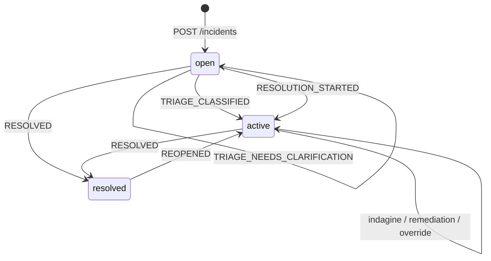
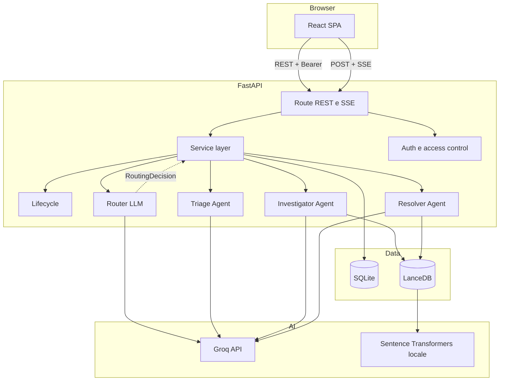

# Debrief — Documentazione tecnica

> Progetto individuale per _Programmazione di Applicazioni Intelligenti_ (MF0781)
>
> Davide La Marca — 20054157

## 1. Problema, obiettivi e perimetro

### 1.1 Il problema

La gestione di un incidente IT non consiste solo nella riparazione tecnica. Il
team deve anche:

- ricostruire sintomi e impatto da informazioni spesso frammentarie;
- assegnare una severità coerente;
- coinvolgere i gruppi competenti;
- recuperare casi e procedure pertinenti;
- mantenere una cronologia condivisa;
- documentare la soluzione affinché sia riutilizzabile.

I ticketing system tradizionali persistono bene i dati, ma non sempre aiutano nel
lavoro cognitivo su testo libero. Debrief esplora l'uso di agenti specializzati e
retrieval semantico per assistere queste attività, lasciando all'essere umano le
decisioni operative.

### 1.2 Obiettivi implementati

Il sistema realizza:

1. classificazione di una segnalazione in linguaggio naturale;
2. collaborazione persistente tra utenti associati a team;
3. routing LLM dei turni destinati a Debrief verso uno specialista, un override
   o `none`;
4. ricerca semantica su incidenti risolti e runbook;
5. remediation con indicazione delle fonti interne quando disponibili;
6. override e chiusura sotto controllo umano;
7. riuso delle soluzioni acquisite;
8. metriche aggregate e harness di valutazione.

### 1.3 Utenti target

Il target iniziale è un reparto IT o un team tecnico di piccole-medie dimensioni
che gestisce manualmente incidenti interni. Il dataset dimostrativo rappresenta
un contesto aziendale con IT interno, fornitori, sviluppo, produzione,
laboratorio e direzione.

L'associazione a un team determina parte della visibilità, ma non corrisponde a
un sistema completo di ruoli o multi-tenancy.

### 1.4 In ambito e fuori ambito

| Implementato oggi                     | Non implementato oggi                       |
| ------------------------------------- | ------------------------------------------- |
| dichiarazione manuale degli incidenti | ingestione da monitoring e alert            |
| tre stati e riapertura                | workflow configurabili, SLA e paging        |
| autenticazione locale semplice        | SSO, OAuth/OIDC, MFA e ruoli                |
| chat persistente e streaming          | notifiche email, Slack o Teams              |
| RAG locale su dati sintetici          | connettori verso ticketing e CMDB           |
| dashboard e MTTR                      | analytics avanzate e report esportabili     |
| SQLite e LanceDB locali               | deployment distribuito e alta disponibilità |
| valutazione mirata degli agenti       | test completi su dati reali e carico        |

## 2. Comportamento funzionale reale

### 2.1 Ciclo di vita

Gli stati persistiti sono soltanto `open`, `active` e `resolved`.



Non esistono stati persistiti come `in_resolution` o `archived`. La chiusura è
consentita sia da `open` sia da `active`; `resolved` può essere riaperto.

La tabella delle transizioni è isolata in
[`src/debrief/api/lifecycle.py`](../src/debrief/api/lifecycle.py). Le transizioni
automatiche avvengono dopo il triage o l'avvio di una remediation; risoluzione e
riapertura richiedono endpoint espliciti.

### 2.2 Happy path

1. L'utente si registra con username, password e team.
2. `POST /incidents` crea un record `open` e persiste la descrizione in timeline.
3. Il frontend apre il dettaglio e, se non è ancora intervenuto un agente, invia
   automaticamente la descrizione alla chat.
4. Il router indirizza il turno al triage.
5. Il triage restituisce titolo, severità, team, sintesi, confidenza ed eventuali
   domande.
6. Quando le informazioni sono sufficienti, lo stato passa ad `active`.
7. I messaggi umani successivi vengono sempre persistiti. Debrief interviene solo
   se il testo contiene `@debrief`.
8. Il router seleziona investigator, resolver, override o nessuna azione.
9. Una persona conferma le modifiche di classificazione e inserisce il riepilogo
   di chiusura.
10. Il backend persiste la chiusura, costruisce il debriefing e tenta di aggiornare
    LanceDB.

### 2.3 Human-in-the-loop

Il controllo umano non è un dettaglio accessorio:

- il triage può chiedere informazioni mancanti;
- l'output degli agenti è un suggerimento, non un comando eseguito sui sistemi;
- un override proposto in chat viene applicato solo dopo conferma;
- una remediation non cambia automaticamente lo stato in `resolved`;
- il riepilogo finale viene scritto da una persona;
- quando non risultano fonti utili, la UI può chiedere il contributo di un esperto.

Debrief va quindi descritto come sistema **AI-assisted**, non autonomo.

### 2.4 Collaborazione e visibilità

Un utente può vedere un incidente se è:

- il creatore;
- un partecipante già registrato;
- membro di un team attualmente coinvolto.

L'apertura del dettaglio o della chat registra l'utente come partecipante. La
rimozione successiva del suo team non revoca la partecipazione già acquisita.
Questo comportamento facilita la continuità della conversazione, ma non equivale
a una policy di autorizzazione completa.

## 3. Architettura

### 3.1 Vista d'insieme



### 3.2 Moduli

| Percorso                       | Responsabilità                                     |
| ------------------------------ | -------------------------------------------------- |
| `src/debrief/api/app.py`       | composizione FastAPI, CORS, startup e health check |
| `src/debrief/api/routes_*.py`  | validazione HTTP e mapping degli errori            |
| `src/debrief/api/service.py`   | chat, persistenza, lifecycle e learning loop       |
| `src/debrief/api/lifecycle.py` | transizioni di stato pure                          |
| `src/debrief/auth.py`          | bcrypt, sessioni opache e utente corrente          |
| `src/debrief/database.py`      | schema e data access SQLite                        |
| `src/debrief/agents/`          | router, triage, investigator e resolver            |
| `src/debrief/tools/`           | embedding e tool esposti agli agenti               |
| `src/debrief/rag/`             | indicizzazione e retrieval LanceDB                 |
| `frontend/src/`                | SPA, cache client e consumo dello stream           |
| `seed/`                        | team, incidenti sintetici e runbook                |
| `eval/`                        | casi e runner di valutazione                       |

Le route sono volutamente sottili; il service layer coordina gli aggiornamenti.
La persistenza delle conversazioni è implementata dall'applicazione su SQLite,
non dalla memoria nativa di Agno.

### 3.3 Streaming

`POST /incidents/{id}/chat` restituisce `text/event-stream`. Il service usa un
generatore sincrono; FastAPI lo esegue in un threadpool, così le operazioni
bloccanti su SQLite, LanceDB, embedding e provider LLM non occupano direttamente
l'event loop.

Il frontend usa `fetch` e legge il `ReadableStream` manualmente. `EventSource` non
è sufficiente perché il protocollo applicativo richiede POST e un header Bearer.

### 3.4 Contesto conversazionale

Gli agenti sono creati senza memoria interna persistente. Prima di ogni turno il
service ricostruisce al massimo gli ultimi 12 eventi conversazionali di tipo
`message`, `triage`, `resolution` e `override` e li inserisce nel prompt.

Questa scelta rende esplicito il contesto e limita i token, ma non fornisce la
memoria completa della conversazione.

## 4. Agenti e orchestrazione

### 4.1 Router

Il router è un normale `Agent` Agno separato, non un `Team` coordinator. Usa lo
stato, i primi 300 caratteri della descrizione e il messaggio corrente per
produrre un `RoutingDecision`.

I ruoli ammessi sono:

- `triage`;
- `investigator`;
- `resolver`;
- `override`;
- `none`.

In caso di errore del router, il fallback deterministico sceglie `triage` per un
incidente `open` e `none` negli altri stati. La conversione in `AgentRole` valida
che il ruolo appartenga all'insieme chiuso previsto. I vincoli di fase sono però
descritti soprattutto nel prompt: manca una guardia deterministica che verifichi
la compatibilità tra ruolo valido e stato corrente.

Viene eseguito un solo specialista per turno: non esiste una pipeline automatica
triage → investigator → resolver nella stessa richiesta.

### 4.2 Triage Agent

Input: descrizione e, quando disponibile, cronologia recente.

Output Pydantic `TriageOutput`:

| Campo                  | Significato                     |
| ---------------------- | ------------------------------- |
| `title`                | titolo sintetico                |
| `severity`             | `SEV1`, `SEV2`, `SEV3` o `SEV4` |
| `suggested_teams`      | ID presenti nel catalogo        |
| `summary`              | sintesi italiana                |
| `needs_clarification`  | necessità di altri dettagli     |
| `clarifying_questions` | domande da mostrare all'utente  |
| `confidence`           | valore tra 0 e 1                |

Il catalogo reale dei team viene inserito nel prompt. Dopo la generazione, il
backend rimuove gli ID non presenti nel catalogo. Il triage non interroga LanceDB.
I team validi suggeriti vengono registrati subito come eventi `involvement` e
concedono visibilità ai loro membri; questa assegnazione automatica non richiede
la conferma usata invece per gli override proposti in chat.

### 4.3 Investigator Agent

L'investigator risponde a domande su casi analoghi, pattern e possibili cause.
Possiede un solo tool:

- `search_past_incidents(query)`.

Non legge direttamente SQLite attraverso un tool. La descrizione e la cronologia
recente gli vengono passate dal service nel prompt.

La sua policy gli vieta di presentare una remediation come se fosse un'indagine e
gli richiede di citare soltanto gli ID restituiti dal retrieval. Il tool gli
espone ID, titolo, severità e risoluzione, ma non il testo completo indicizzato:
pattern e possibili cause restano quindi inferenze su evidenze sintetiche.

### 4.4 Resolver Agent

Il resolver propone passi operativi usando:

1. `search_past_incidents(query)`;
2. `search_knowledge_base(query)`;
3. conoscenza generale, dichiarata come tale quando le fonti interne non bastano.

Il resolver non esegue azioni sui sistemi e non chiude l'incidente. Se nessuna
tool call restituisce evidenze utili, il service emette
`human_help_required` e registra un'escalation.

### 4.5 Override

`override` non è un quarto agente operativo. Il router estrae severità e team da
aggiungere o rimuovere. Il backend filtra gli ID non validi e invia una proposta
alla UI; soltanto `PATCH /incidents/{id}/classification` applica la modifica.

Ogni override effettivo aggiunge alla timeline un JSON con stato precedente,
variazioni e timestamp.

## 5. Persistenza e modello dati

### 5.1 SQLite

SQLite conserva lo stato autorevole dell'applicazione.

| Tabella                 | Contenuto                                       |
| ----------------------- | ----------------------------------------------- |
| `teams`                 | catalogo dei team e contatti                    |
| `users`                 | username, hash bcrypt e team                    |
| `sessions`              | token opachi e utente associato                 |
| `incidents`             | descrizione, classificazione, stato e timestamp |
| `incident_participants` | membri della conversazione e attività           |
| `timeline_events`       | log append-only degli eventi a runtime          |
| `debrief_reports`       | report JSON, uno per incidente                  |

Tipi di evento prodotti dal codice:

- `message`;
- `triage`;
- `involvement` e `disinvolvement`;
- `resolution`;
- `escalation`;
- `override`;
- `reopen`;
- `human_solution`.

Il campo `actor` può contenere un ID utente, uno username o un nome logico di
agente. Le join della timeline arricchiscono i casi riconducibili a un utente,
ma il formato non è uniformemente normalizzato.

### 5.2 LanceDB

Il database vettoriale contiene due sole collezioni:

| Collezione       | Campi principali                                          | Origine                                   |
| ---------------- | --------------------------------------------------------- | ----------------------------------------- |
| `past_incidents` | `id`, `title`, `severity`, `text`, `resolution`, `vector` | incidenti risolti e aggiornamenti runtime |
| `knowledge_base` | `id`, `title`, `text`, `vector`                           | runbook Markdown                          |

Il testo incorporato per un incidente è:

```text
title + description + resolution
```

Non esistono campi dedicati `root_cause` o `resolution_steps` nel record
vettoriale. I runbook sono indicizzati come documenti interi, senza chunking; il
tool ne passa al modello al massimo i primi 1.500 caratteri.

La policy del resolver richiede identificatori di fonte esatti, ma il formatter
del tool knowledge base espone nell'intestazione il titolo e non un campo ID
separato. La provenance dei runbook è quindi un guardrail di prompt ancora da
rafforzare a livello applicativo.

### 5.3 Embedding e retrieval

Il modello predefinito è
`paraphrase-multilingual-MiniLM-L12-v2`. Gli embedding sono normalizzati e
calcolati localmente con Sentence Transformers.

| Ricerca          | Top-k | Soglia minima |
| ---------------- | ----: | ------------: |
| incidenti simili |     3 |          0,55 |
| knowledge base   |     3 |          0,35 |

LanceDB restituisce una distanza; il codice la converte in similarità con
`1 - distance / 2`, assumendo vettori normalizzati e la metrica attesa.
I fallimenti del retrieval vengono registrati nei log e restituiti agli agenti
come lista vuota.

### 5.4 Learning loop effettivo

Alla chiusura:

1. SQLite viene aggiornato a `resolved`;
2. il riepilogo umano entra nella timeline;
3. viene salvato il debriefing JSON;
4. `title + description + resolution` viene incorporato;
5. il record viene inserito o sostituito in `past_incidents`.

Una soluzione inserita tramite `human-solutions` viene salvata come evento e
indicizzata nello stesso modo. Non esiste una collezione separata di soluzioni
verificate: più contributi per lo stesso incidente sostituiscono il medesimo
record vettoriale. La verifica editoriale e il versionamento sono in roadmap.

SQLite resta la fonte autorevole. Un errore di indicizzazione viene loggato ma
non annulla una chiusura già persistita.

### 5.5 Debriefing

Il debriefing non è oggi una sintesi generata dal resolver. Il service costruisce
un `DebriefReport` deterministico con:

- `incident_id`;
- `title`;
- `severity`;
- timeline validabile;
- `resolution` fornita dalla persona che chiude.

Campi come impatto, root cause, action item, owner e follow-up non vengono
derivati nella versione corrente.

I 15 report caricati dal seed hanno una shape storica più compatta: contengono
`incident_id`, `title`, `severity` e `resolution`, ma non `timeline`. L'API può
quindi esporre report seed minimali e report runtime completi; uniformare il
contratto fa parte del consolidamento futuro.

## 6. Dataset dimostrativo

`uv run seed` usa:

- 7 team in `seed/teams.json`;
- 15 incidenti in `seed/incidents.json`;
- 7 runbook in `seed/knowledge_base/`.

Distribuzione degli incidenti:

| Stato      | Numero | Uso                                            |
| ---------- | -----: | ---------------------------------------------- |
| `resolved` |     15 | indicizzati inizialmente in `past_incidents`   |
| `active`   |      3 | persistiti in SQLite come casi in lavorazione  |
| `open`     |      2 | persistiti in SQLite come casi da classificare |

Tutti i 20 record vengono persistiti in SQLite; soltanto i 15 risolti entrano
nel RAG iniziale.

Lo script crea le tabelle mancanti, inserisce o sostituisce i record seed,
rigenera le due collezioni LanceDB ed esegue tre query di smoke test. Non azzera
completamente SQLite: utenti, sessioni e record runtime non collidenti restano
presenti. Non va quindi usato come strategia di migrazione o reset in produzione.

Il dataset è sintetico e serve a riproducibilità, demo e valutazione controllata;
non rappresenta evidenza di efficacia su dati operativi reali.

## 7. API

### 7.1 Endpoint

| Metodo | Path                              | Auth | Comportamento                                    |
| ------ | --------------------------------- | ---- | ------------------------------------------------ |
| GET    | `/health`                         | no   | liveness superficiale                            |
| GET    | `/auth/teams`                     | no   | catalogo team                                    |
| POST   | `/auth/register`                  | no   | registrazione e auto-login                       |
| POST   | `/auth/login`                     | no   | rilascio token                                   |
| POST   | `/auth/logout`                    | sì   | revoca token                                     |
| GET    | `/auth/me`                        | sì   | utente corrente                                  |
| POST   | `/incidents`                      | sì   | crea un incidente `open`                         |
| GET    | `/incidents`                      | sì   | lista filtrabile per stato                       |
| GET    | `/incidents/{id}`                 | sì   | dettaglio, timeline, team, partecipanti e report |
| POST   | `/incidents/{id}/chat`            | sì   | risposta SSE                                     |
| PATCH  | `/incidents/{id}/classification`  | sì   | override severità/team                           |
| POST   | `/incidents/{id}/resolve`         | sì   | chiusura manuale                                 |
| POST   | `/incidents/{id}/reopen`          | sì   | riapertura                                       |
| POST   | `/incidents/{id}/human-solutions` | sì   | acquisizione soluzione umana                     |
| GET    | `/metrics`                        | sì   | conteggi e MTTR sugli incidenti visibili         |

FastAPI espone inoltre `/docs`, `/redoc` e `/openapi.json`.

### 7.2 Eventi SSE

Ogni frame ha il formato `data: <json>\n\n` e usa il campo JSON `type`:

| Tipo                  | Contenuto                       |
| --------------------- | ------------------------------- |
| `routing`             | agente scelto e motivazione     |
| `tool`                | nome del tool avviato           |
| `token`               | frammento di testo              |
| `triage`              | output strutturato              |
| `override_proposed`   | modifica da confermare          |
| `human_help_required` | richiesta di contributo esperto |
| `done`                | stato finale del turno          |
| `error`               | messaggio d'errore nello stream |

Non sono presenti heartbeat, resume tramite event ID o riconnessione automatica.

### 7.3 Autenticazione

Le password sono hashate con bcrypt. Il login genera un token casuale opaco,
salvato nella tabella `sessions`; il logout lo elimina. Il client lo conserva in
`localStorage` e lo invia come `Authorization: Bearer ...`.

Per un prototipo questo meccanismo è semplice e revocabile. Per un contesto
professionale presenta limiti importanti:

- token senza scadenza o rotazione;
- token server-side memorizzato in chiaro;
- password con requisito minimo di un solo carattere;
- registrazione libera su qualsiasi team;
- assenza di ruoli e autorizzazioni per singola azione.

### 7.4 Configurazione HTTP

Lo sviluppo usa:

- backend `127.0.0.1:8000` con reload;
- frontend `localhost:5173`;
- CORS consentito da `localhost:5173` e `localhost:3000`;
- URL API frontend fisso a `http://localhost:8000`.

Questi valori non costituiscono una configurazione di deployment.

## 8. Frontend

La SPA usa React 19, TypeScript 6, Vite 8, React Router 7, TanStack Query 5 e
Tailwind CSS 3.

| Rotta            | Funzione                              |
| ---------------- | ------------------------------------- |
| `/login`         | login e registrazione con scelta team |
| `/`              | dashboard protetta                    |
| `/incidents/:id` | dettaglio e chat protetti             |

La dashboard mostra incidenti assegnati, aperti/attivi, risolti e MTTR. Il
dettaglio mostra descrizione, partecipanti, team, timeline sintetica, debriefing
e conversazione. La UI consente di modificare severità e team finché l'incidente
non è risolto; il relativo endpoint backend non applica però una guardia di stato
equivalente.

La UI:

- consuma Markdown GFM prodotto dagli agenti;
- converte riferimenti `INC-###` in link interni;
- mostra attività di routing e tool;
- supporta domande di chiarimento, override confermabili ed escalation;
- blocca la chat sugli incidenti risolti;
- persiste tema e sessione in `localStorage`;
- usa una vista a due pannelli su desktop e tab su mobile.

React Query considera i dati fresh per 30 secondi. Gli hook di lifecycle
invalidano dettaglio, lista e metriche; il completamento della chat e un override
confermato in chat invalidano invece soltanto il dettaglio. Lista e metriche
possono quindi restare stale fino alla scadenza. Non esiste un canale realtime
globale: SSE copre il singolo turno, non gli aggiornamenti prodotti da altri
utenti.

## 9. Valutazione

### 9.1 Runner

`uv run eval` esegue cinque suite:

| Suite     | Metriche principali                            |
| --------- | ---------------------------------------------- |
| triage    | severity exact, ±1, chiarimenti, team invalidi |
| routing   | accuracy e fallback                            |
| resolver  | ID citati riconosciuti e fonte seed attesa     |
| retrieval | precision@k, recall@k, MRR, hit@1              |
| injection | tasso di blocco                                |

Triage, routing, resolver e injection richiedono `GROQ_API_KEY`; senza chiave
vengono saltate. Retrieval usa il modello di embedding locale e richiede le
tabelle create dal seed.

La metrica resolver confronta gli ID citati con il catalogo seed e con un insieme
atteso; non prova che ogni ID sia apparso nella tool call dello stesso turno e non
valuta la provenance dei runbook.

### 9.2 Interpretazione corretta

L'harness misura capacità AI specifiche, ma non sostituisce una suite di test del
software. Il repository non contiene oggi test automatici backend o frontend per:

- API e validazione;
- autenticazione e autorizzazione;
- lifecycle;
- contratti SSE;
- concorrenza e transazioni;
- accessibilità e flussi browser.

Il runner stampa i risultati in console e non salva report versionati. Un valore
metrico basso, da solo, non determina necessariamente un exit code di errore:
l'uscita non zero è usata soprattutto per esecuzioni LLM fallite o fallback
conteggiati. I risultati vanno quindi letti come diagnostica sperimentale, non
come quality gate completo.

## 10. Limiti noti e rischi

| Area            | Stato attuale                                                      | Evoluzione necessaria                             |
| --------------- | ------------------------------------------------------------------ | ------------------------------------------------- |
| Identità        | registrazione libera e token senza scadenza                        | inviti/SSO, ruoli, expiry e rotazione             |
| Autorizzazione  | accesso per creatore, partecipante o team                          | policy per azione e tenant                        |
| Privacy         | prompt e contesto inviati a Groq                                   | classificazione dati, redazione e policy provider |
| Coerenza        | operazioni multi-step non transazionali                            | unit of work e idempotenza                        |
| Lifecycle       | riapertura conserva `resolved_at` e vecchio report                 | semantica e metriche di riapertura                |
| RAG             | contributi umani non revisionati, ultimo upsert vince              | moderazione, versioni e provenance                |
| Database        | SQLite locale, nessuna migrazione                                  | migrazioni e database server                      |
| Concorrenza     | ID `INC-NNN` calcolato dal massimo corrente                        | generazione atomica                               |
| AI              | nessun timeout/budget/retry applicativo                            | resilienza, circuit breaker e osservabilità       |
| Input           | nessun limite applicativo alla lunghezza di descrizioni e messaggi | limiti, quote e controllo del costo token         |
| Retrieval       | errore e assenza risultati appaiono uguali                         | errori tipizzati e health check                   |
| Streaming       | nessun heartbeat, resume o cancel UI                               | protocollo resiliente                             |
| Bundle frontend | la build segnala un chunk oltre 500 kB                             | analisi bundle e code splitting per rotta         |
| Configurazione  | URL, CORS, host e porta di sviluppo fissi                          | configurazione per ambiente                       |
| Test            | harness AI mirato, nessuna regressione completa                    | unit, integration, E2E e load test                |
| Integrazioni    | nessun alert, ticketing o notifica                                 | connettori e webhook                              |

Ulteriori aspetti:

- le foreign key sono dichiarate, ma la connessione non abilita esplicitamente
  `PRAGMA foreign_keys=ON`;
- una soluzione umana può essere indicizzata anche prima della chiusura;
- il router è vincolato alla fase principalmente dal prompt;
- `/health` non verifica Groq, LanceDB, seed o modello di embedding;
- la lista e le metriche non implementano una paginazione robusta;
- gli errori interni possono arrivare al client nel frame SSE `error`;
- il fetch dedicato alla chat non usa l'handler globale dei `401` delle altre
  chiamate REST, quindi la pulizia della sessione non è uniforme;
- il frontend non offre annullamento o riconnessione dello stream;
- il bundle usa un font remoto, con fallback locale.

Questi limiti non annullano il valore dimostrativo, ma definiscono il confine tra
prototipo accademico e prodotto affidabile.

## 11. Roadmap verso un uso professionale

### Fase 1 — consolidare il prototipo

- introdurre test unitari, di integrazione API ed end-to-end;
- correggere la semantica di riapertura e rendere idempotenti i flussi;
- aggiungere migrazioni, vincoli DB e transazioni;
- configurare URL, CORS, host, modelli e soglie per ambiente;
- strutturare logging, tracing, metriche tecniche e health check profondi.

### Fase 2 — sicurezza e deployment

- sostituire la registrazione libera con inviti o identity provider;
- definire ruoli e permessi per team e azione;
- usare sessioni temporizzate e cookie sicuri oppure un'architettura token
  adeguatamente protetta;
- introdurre HTTPS, secret management, backup e recovery;
- migrare lo stato condiviso verso un database server e validare più istanze.

### Fase 3 — valore operativo

- integrare monitoring, ticketing, paging e notifiche;
- aggiungere ricerca, paginazione, audit ed export;
- introdurre ownership e action item nel debriefing;
- revisionare e versionare la conoscenza acquisita;
- valutare gli agenti su dataset più ampi e dati reali anonimizzati;
- misurare qualità, latenza, costo, drift e feedback degli operatori.

## 12. Valore accademico

Il progetto consente di discutere concretamente:

- specializzazione e routing tra agenti;
- output strutturati e validazione Pydantic;
- RAG con embedding locali e doppia persistenza;
- streaming di output agentici;
- prompt difensivi e provenance;
- human-in-the-loop;
- valutazione quantitativa e limiti della misurazione;
- trade-off tra semplicità riproducibile e requisiti di produzione.

Il lavoro è individuale. La ricognizione della codebase, la revisione di coerenza
e la redazione aggiornata di questa documentazione sono state assistite da
strumenti AI. La responsabilità del codice, delle scelte e della loro spiegazione
resta dell'autore.

## Conclusione

Debrief implementa un percorso completo dalla segnalazione alla capitalizzazione
della soluzione. Il contributo centrale non è l'automazione indiscriminata:
consiste nel combinare classificazione, retrieval e remediation in una
conversazione persistente, con confini umani espliciti.

La versione corrente è coerente con una dimostrazione universitaria e rende
visibili anche i propri limiti. La roadmap concentra la crescita professionale
su sicurezza, affidabilità, configurabilità, integrazioni e valutazione continua,
senza attribuire al prototipo capacità che il codice non possiede.
